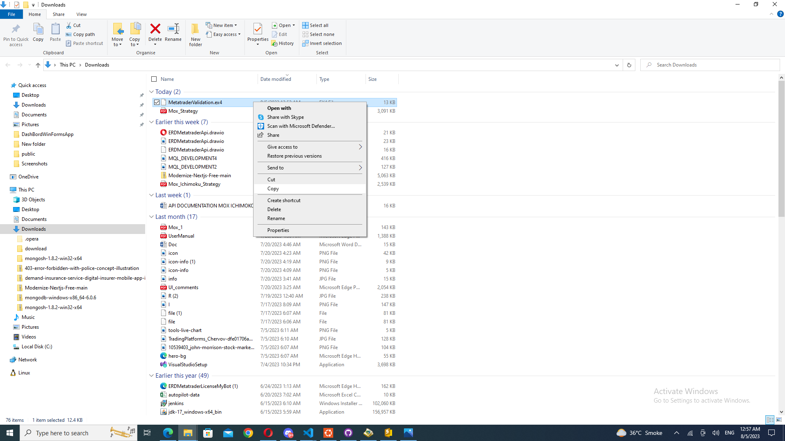

# Instructions for adding licensing code to an Expert Advisor and Indicator in both MetaTrader 4 (MT4) and MetaTrader 5 (MT5)

## Description

The above steps describe how to implement a licensing code in an Expert Advisor/Indicator  for MetaTrader 4 (MT4) and MetaTrader 5 (MT5). First, a unique Product Code is generated as an identifier for the license. The Expert Advisor's code is then modified by replacing a string with the generated Product Code. The Expert Advisor is compiled, and the resulting .ex4 (or .ex5) file is provided to the client. The client is instructed to input the provided Serial Key when attaching the Expert Advisor to a chart. The Expert Advisor internally validates the license by comparing the Product Code and Serial Key using the MetaTraderValidation library. If validation is successful, the Expert Advisor functions normally; otherwise, it takes appropriate action based on the implementation. This process helps protect the Expert Advisor and ensures that only authorized clients can use it.

## Table of Content
* [For MetaTrader 4 (MT4) Expert Advisor](#for-metatrader-4-mt4-expert-advisor)
* [For MetaTrader 4 (MT4) Indicator](#for-metatrader-4-mt4-indicator)
* [For MetaTrader 5 (MT4) Expert Advisor](#for-metatrader-5-mt4-expert-advisor)
* [For MetaTrader 5 (MT4) Indicator](#for-metatrader-5-mt4-indicator)
* [Special Instruction For MAC and Metatrader's VPS](#special-instruction-for-mac-and-metatraders-vps)


# For MetaTrader 4 (MT4) Expert Advisor

## Step 1: Copy the MetatraderValidation.ex4 file

Open your download folder and copy the MetatraderValidation.ex4 file.



## Step 2: Open MT4 Application

Open the MetaTrader 4 (MT4) application.

.png)


## Step 3: Open Data Folder

Go to "File" in the top menu and click "Open Data Folder."

.png)

## Step 4: Navigate to MQL4 Folder

In the Data Folder, click on the "MQL4" folder.

.png)


## Step 5: Open Libraries Folder

Within the MQL4 folder, locate and open the "Libraries" folder.

.png)

## Step 6: Paste MetatraderValidation.ex4

Paste the MetatraderValidation.ex4 file you copied earlier into the "Libraries" folder.

.png)

## Step 7: Navigate to Experts Folder

Go back to the "MQL4" folder and click on the "Experts" folder.

.png)


## Step 8: Open the Expert Advisor (EA)

Locate and open the Expert Advisor (EA) you want to license using the MetaEditor.

.png)


## Step 9: Add License Code (Above OnInit)

Place the following code above the OnInit() function of your Expert Advisor:

```echo
//-------------------License Code Start----------------------//

#import "MetatraderValidation.ex4"
bool Validate(string Serialkey,string productCode);
void updateConnectionStatus(string);
void updateHardwareId(string);
void updateConnectionStatusConnected(string);
void updateConnectionStatusDisconnected(string);

#import
bool auth = false;

input string strMA1="---------------------------------------- License Input ----------------------------------------";//<<<<<<<< License Input >>>>>>>>

input string serialkey = ""; //Serial Keys
string ProductCode="MACD Demo EA";//Product Code
//----------------License Code End--------------------------//


```

.png)

## Step 10: Add License Code (OnInit)

Place the following code inside the OnInit() function of your Expert Advisor:

```echo
//-------------------License Code Start----------------------//

if(IsDllsAllowed()==false) 
    { 
     Alert("DLL call is not allowed. Experts cannot run.");
    } 
   if(MQLInfoInteger(MQL_OPTIMIZATION) == 0)
     {
      updateHardwareId(serialkey);
      auth = Validate(serialkey,ProductCode);
      if(auth == true)
        {
         Comment("Active");
         updateConnectionStatusConnected(serialkey);
        }
      if(auth == false)
        {
         Comment("Inactive. Contact Provider to Activate");
         ExpertRemove();
        }
     }

//----------------License Code End--------------------------//
```
.png)


## Step 11: Add License Code (OnDeinit)

Place the following code inside the OnDeinit() function of your Expert Advisor:

```echo
//-------------------License Code Start----------------------//

 if(MQLInfoInteger(MQL_OPTIMIZATION) == 0)
     {
      updateConnectionStatusDisconnected(serialkey);
     }

//----------------License Code End--------------------------//
```

.png)

## Step 12: Add License Code (OnTick)

Place the following code inside the OnTick() function of your Expert Advisor:

```echo
//-------------------License Code Start----------------------//

 if(MQLInfoInteger(MQL_OPTIMIZATION) == 0 && MQLInfoInteger(MQL_TESTER) == 0)
     {
      auth = Validate(serialkey,ProductCode);
      if(auth == true)
        {
         Comment("Active");
        }
      if(auth == false)
        {
         Comment("Inactive. Contact Provider to Activate");
         return ;
        }
     }
//----------------License Code End--------------------------//
```

.png)


## Step 13: Replace the Product Code

Replace the string "MACD Demo EA" with your generated Product Code, the Expert Advisor will use this Product Code to validate the license key provided by the client using the MetaTraderValidation library.

.png)


.png)


## Step 14: Compile and Provide to Client

Compile the Expert Advisor and provide your client the resulting .ex4 files (yourExpert.ex4 and MetatraderValidation.ex4).

## Step 15: Instruct the Client

Instruct your client to enter the Serial Key in the "serial key" input field of the Expert Advisor when placing the Expert Advisor on the chart.

.png)

## Step 16: Validation

The Expert Advisor will validate the Serial Key with the MetaTraderValidation library and allow the client to use the Expert Advisor if the validation is successful.

.png)

# For MetaTrader 4 (MT4) Indicator

## Step 1: Copy the MetatraderValidation.ex4 file

Open your download folder and copy the MetatraderValidation.ex4 file.


## Step 2: Open MT4 Application

Open the MetaTrader 4 (MT4) application.

.png)


## Step 3: Open Data Folder

Go to "File" in the top menu and click "Open Data Folder."

.png)

## Step 4: Navigate to MQL4 Folder

In the Data Folder, click on the "MQL4" folder.

.png)


## Step 5: Open Libraries Folder

Within the MQL4 folder, locate and open the "Libraries" folder.

.png)

## Step 6: Paste MetatraderValidation.ex4

Paste the MetatraderValidation.ex4 file you copied earlier into the "Libraries" folder.

.png)

## Step 7: Navigate to Indicators Folder

Go back to the "MQL4" folder and click on the "Indicators" folder.

.png)


## Step 8: Open the Indicators

Locate and open the Indicator you want to license using the MetaEditor.

.png)


## Step 9: Add License Code (Above OnInit)

Place the following code above the OnInit() function of your Indicator:

```echo
//-------------------License Code Start----------------------//

#import "MetatraderValidation.ex4"
bool Validate(string Serialkey,string productCode);
void updateConnectionStatus(string);
void updateHardwareId(string);
void updateConnectionStatusConnected(string);
void updateConnectionStatusDisconnected(string);

#import
bool auth = false;

input string strMA1="---------------------------------------- License Input ----------------------------------------";//<<<<<<<< License Input >>>>>>>>

input string serialkey = ""; //Serial Keys
string ProductCode="MACD Demo EA";//Product Code
string shortname;

//----------------License Code End--------------------------//
```

.png)

## Step 10: Add License Code (OnInit)

Place the following code inside the OnInit() function of your Indicator:

```echo
//-------------------License Code Start----------------------//

if(IsDllsAllowed()==false) 
    { 
     Alert("DLL call is not allowed. Indicator cannot run.");
    } 
   if(MQLInfoInteger(MQL_OPTIMIZATION) == 0)
     {
      updateHardwareId(serialkey);
      auth = Validate(serialkey,ProductCode);
      if(auth == true)
        {
         Comment("Active");
         updateConnectionStatusConnected(serialkey);
        }
      if(auth == false)
        {
         Comment("Inactive. Contact Provider to Activate");
         shortname=ProductCode;
         IndicatorSetString(INDICATOR_SHORTNAME,shortname);
         int window=ChartWindowFind();
         bool res=ChartIndicatorDelete(0,window,shortname);
         return(INIT_FAILED);
        }
     }

//----------------License Code End--------------------------//
```
.png)


## Step 11: Add License Code (OnDeinit)

Add the following code at the end  of your Indicator:

```echo
//-------------------License Code Start----------------------//

void OnDeinit(const int reason)
  {
if(MQLInfoInteger(MQL_OPTIMIZATION) == 0)
     {
      updateConnectionStatusDisconnected(serialkey);
     }
  }

//----------------License Code End--------------------------//
```

.png)

## Step 12: Add License Code (OnCalculate)

Place the following code inside the OnCalculate() function of your Indicator:

```echo
//-------------------License Code Start----------------------//

  if(MQLInfoInteger(MQL_OPTIMIZATION) == 0 && MQLInfoInteger(MQL_TESTER) == 0)
     {
      auth = Validate(serialkey,ProductCode);
      if(auth == true)
        {
         Comment("Active");
        }
      if(auth == false)
        {
         Comment("Inactive. Contact Provider to Activate");
         return(rates_total);
        }
     }
//----------------License Code End--------------------------//

```

.png)


## Step 13: Replace the Product Code

Replace the string "MACD Demo EA" with your generated Product Code, the Indicator will use this Product Code to validate the license key provided by the client using the MetaTraderValidation library.

.png)


.png)


## Step 14: Compile and Provide to Client

Compile the Indicator and provide your client the resulting .ex4 files (yourIndicator.ex4 and MetatraderValidation.ex4).

## Step 15: Instruct the Client

Instruct your client to enter the Serial Key in the "serial key" input field of the Indicator when placing the Indicator on the chart.

.png)

## Step 16: Validation

The Indicator will validate the Serial Key with the MetaTraderValidation library and allow the client to use the Indicator if the validation is successful.

.png)


# For MetaTrader 5  (MT5) Expert Advisor

## Step 1: Copy the MetatraderValidation.ex5 file

Open your download folder and copy the MetatraderValidation.ex5 file.

.png)

## Step 2: Open MT5 Application

Open the MetaTrader 5 (MT5) application.

.png)


## Step 3: Open Data Folder

Go to "File" in the top menu and click "Open Data Folder."

.png)

## Step 4: Navigate to MQL5 Folder

In the Data Folder, click on the "MQL5" folder.

.png)


## Step 5: Open Libraries Folder

Within the MQL5 folder, locate and open the "Libraries" folder.

.png)

## Step 6: Paste MetatraderValidation.ex5

Paste the MetatraderValidation.ex5 file you copied earlier into the "Libraries" folder.

.png)

## Step 7: Navigate to Experts Folder

Go back to the "MQL5" folder and click on the "Experts" folder.

.png)


## Step 8: Open the Expert Advisor (EA)

Locate and open the Expert Advisor (EA) you want to license using the MetaEditor.

.png)


## Step 9: Add License Code (Above OnInit)

Place the following code above the OnInit() function of your Expert Advisor:

```echo
//-------------------License Code Start----------------------//

#import "MetatraderValidation.ex5"
bool Validate(string,string);
void updateConnectionStatus(string);
void updateHardwareId(string);
void updateConnectionStatusConnected(string);
void updateConnectionStatusDisconnected(string);
#import
bool auth = false;   

input string strMA1="---------------------------------------- License Input ----------------------------------------";//<<<<<<<< License Input >>>>>>>>

input string serialkey = ""; //Serial Keys
string ProductCode = "";//Product Code

//----------------License Code End--------------------------//

```

.png)

## Step 10: Add License Code (OnInit)

Place the following code inside the OnInit() function of your Expert Advisor:

```echo
//-------------------License Code Start----------------------//

if(!TERMINAL_DLLS_ALLOWED)
     {
      Alert("Please Allow DLL Imports!");
     }
   if(MQLInfoInteger(MQL_OPTIMIZATION) == 0)
     {
      updateHardwareId(serialkey);
      auth = Validate(serialkey,ProductCode);
      if(auth == true)
        {
         Comment("Active");
         updateConnectionStatusConnected(serialkey);
        }
      if(auth == false)
        {
         Comment("Inactive. Contact Provider to Activate");
         ExpertRemove();
        }
     }

//----------------License Code End--------------------------//
```
.png)


## Step 11: Add License Code (OnDeinit)

Place the following code inside the OnDeinit() function of your Expert Advisor:

```echo
//-------------------License Code Start----------------------//

  if(MQLInfoInteger(MQL_OPTIMIZATION) == 0)
     {
      updateConnectionStatusDisconnected(serialkey);
     }

//----------------License Code End--------------------------//

```

.png)

## Step 12: Add License Code (OnTick)

Place the following code inside the OnTick() function of your Expert Advisor:

```echo
//-------------------License Code Start----------------------//

 if(MQLInfoInteger(MQL_OPTIMIZATION) == 0 && MQLInfoInteger(MQL_TESTER) == 0)
     {
      auth = Validate(serialkey,ProductCode);
      if(auth == true)
        {
         Comment("Active");
        }
      if(auth == false)
        {
         Comment("Inactive. Contact Provider to Activate");
         return ;
        }
     }

//----------------License Code End--------------------------//

```

.png)


## Step 13: Replace the Product Code

Replace the string "" with the your generated Product Code, the Expert Advisor will use this Product Code to validate the license key provided by the client using the MetaTraderValidation library.


.png)

.png)


## Step 14: Compile and Provide to Client

Compile the Expert Advisor and provide your client the resulting .ex5 files (yourExpert.ex5 and MetatraderValidation.ex5).

## Step 15: Instruct the Client

Instruct your client to enter the Serial Key in the "serial key" input field of the Expert Advisor when placing the Expert Advisor on the chart.

.png)

## Step 16: Validation

The Expert Advisor will validate the Serial Key with the MetaTraderValidation library and allow the client to use the Expert Advisor if the validation is successful.

.png)

# For MetaTrader 5 (MT5) Indicator

## Step 1: Copy the MetatraderValidation.ex5 file

Open your download folder and copy the MetatraderValidation.ex5 file.

.png)

## Step 2: Open MT5 Application

Open the MetaTrader 5 (MT5) application.

.png)


## Step 3: Open Data Folder

Go to "File" in the top menu and click "Open Data Folder."

.png)

## Step 4: Navigate to MQL5 Folder

In the Data Folder, click on the "MQL5" folder.

.png)


## Step 5: Open Libraries Folder

Within the MQL5 folder, locate and open the "Libraries" folder.

.png)

## Step 6: Paste MetatraderValidation.ex5

Paste the MetatraderValidation.ex5 file you copied earlier into the "Libraries" folder.

.png)

## Step 7: Navigate to Indicators Folder

Go back to the "MQL5" folder and click on the "Indicators" folder.

.png)


## Step 8: Open the Indicators

Locate and open the Indicator you want to license using the MetaEditor.

.png)


## Step 9: Add License Code (Above OnInit)

Place the following code above the OnInit() function of your Indicator:

```echo
//-------------------License Code Start----------------------//

#import "MetatraderValidation.ex5"
bool Validate(string,string);
void updateConnectionStatus(string);
void updateHardwareId(string);
void updateConnectionStatusConnected(string);
void updateConnectionStatusDisconnected(string);
#import
bool auth = false;   

input string strMA1="---------------------------------------- License Input ----------------------------------------";//<<<<<<<< License Input >>>>>>>>

input string serialkey = ""; //Serial Keys
string ProductCode = "";//Product Code
string shortname;

//----------------License Code End--------------------------//

```

.png)

## Step 10: Add License Code (OnInit)

Place the following code inside the OnInit() function of your Indicator:

```echo
//-------------------License Code Start----------------------//

if(!TERMINAL_DLLS_ALLOWED)
     {
      Alert("Please Allow DLL Imports!");
     }
   if(MQLInfoInteger(MQL_OPTIMIZATION) == 0)
     {
      updateHardwareId(serialkey);
      auth = Validate(serialkey,ProductCode);
      if(auth == true)
        {
         Comment("Active");
         updateConnectionStatusConnected(serialkey);
        }
      if(auth == false)
        {
         shortname=ProductCode;
         IndicatorSetString(INDICATOR_SHORTNAME,shortname);
         Comment("Inactive. Contact Provider to Activate");
         int window=ChartWindowFind();
         bool res=ChartIndicatorDelete(0,window,shortname);
         return(INIT_FAILED);
        }
     }

//----------------License Code End--------------------------//

```
.png)


## Step 11: Add License Code (OnDeinit)

Add the following code at the end  of your Indicator:

```echo
//-------------------License Code Start----------------------//

void OnDeinit(const int reason)
  {
   if(MQLInfoInteger(MQL_OPTIMIZATION) == 0)
     {
      updateConnectionStatusDisconnected(serialkey);
     }

  }

//----------------License Code End--------------------------//

```

.png)

## Step 12: Add License Code (OnCalculate)

Place the following code inside the OnCalculate() function of your Indicator:

```echo
//-------------------License Code Start----------------------//

  if(MQLInfoInteger(MQL_OPTIMIZATION) == 0 && MQLInfoInteger(MQL_TESTER) == 0)
     {
      auth = Validate(serialkey,ProductCode);
      if(auth == true)
        {
         Comment("Active");
        }
      if(auth == false)
        {
         Comment("Inactive. Contact Provider to Activate");
         return rates_total;
        }
     }

//----------------License Code End--------------------------//
```

.png)


## Step 13: Replace the Product Code

Replace the string "" with your generated Product Code, the Indicator will use this Product Code to validate the license key provided by the client using the MetaTraderValidation library.

.png)


.png)


## Step 14: Compile and Provide to Client

Compile the Expert Advisor and provide your client the resulting .ex5 files (yourIndicator.ex5 and MetatraderValidation.ex5).

## Step 15: Instruct the Client

Instruct your client to enter the Serial Key in the "serial key" input field of the Indicator when placing the Indicator on the chart.

.png)

## Step 16: Validation

The Indicator will validate the Serial Key with the MetaTraderValidation library and allow the client to use the Indicator if the validation is successful.

.png)

# Special Instruction for MAC and Metatrader's VPS

## Step 1: Open Experts options.

Go to tools and click for options.

.png)

## Step 2: Add a link to the allowed list.

Add this link and also allow the web request. https://api.licensemybot.com/.

.png)
